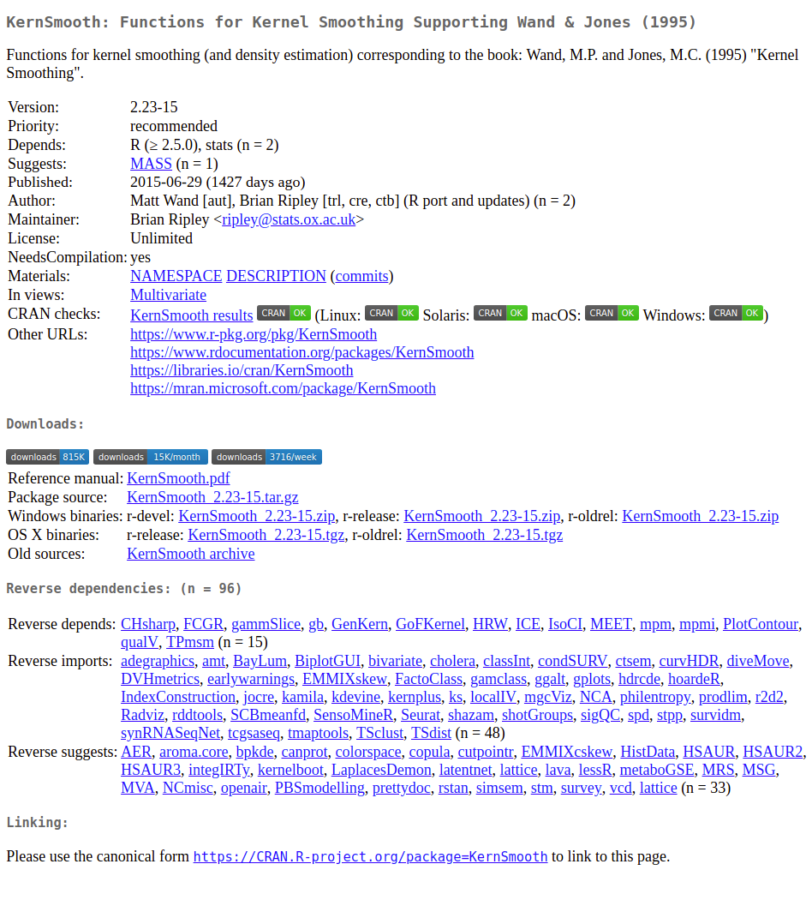

# R CRAN Booster

'R CRAN Booster' is a Google Chrome browser extension that enhances the browsing experience on [The R Project](https://www.r-project.org)'s [CRAN](https://cran.r-project.org/) package pages.

## Installation

To add this extension to Chrome, install it via Chrome menu 'More tools' -> 'Extensions'.  Then click 'Load unpacked', navigate to the 'R_CRAN_Booster/ChromeExtension' folder, and select 'Open'.  Done.

## License

This extension is licensed under [LGPL (>= 3)](https://www.gnu.org/licenses/lgpl.txt).

## Contributions

This Git repository uses the [Git Flow](http://nvie.com/posts/a-successful-git-branching-model/) branching model (the [`git flow`](https://github.com/petervanderdoes/gitflow-avh) extension is useful for this).  The [`develop`](https://github.com/HenrikBengtsson/R_CRAN_Booster/tree/develop) branch contains the latest contributions and other code that will appear in the next release, and the [`master`](https://github.com/HenrikBengtsson/R_CRAN_Booster) branch contains the latest, stable release.  Contributing to this package is easy.  Just send a [pull request](https://help.github.com/articles/using-pull-requests/).  When you send your PR, make sure `develop` is the destination branch on the [R_CRAN_Booster repository](https://github.com/HenrikBengtsson/R_CRAN_Booster).