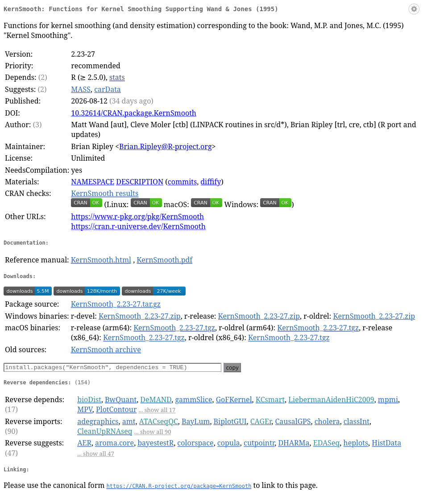
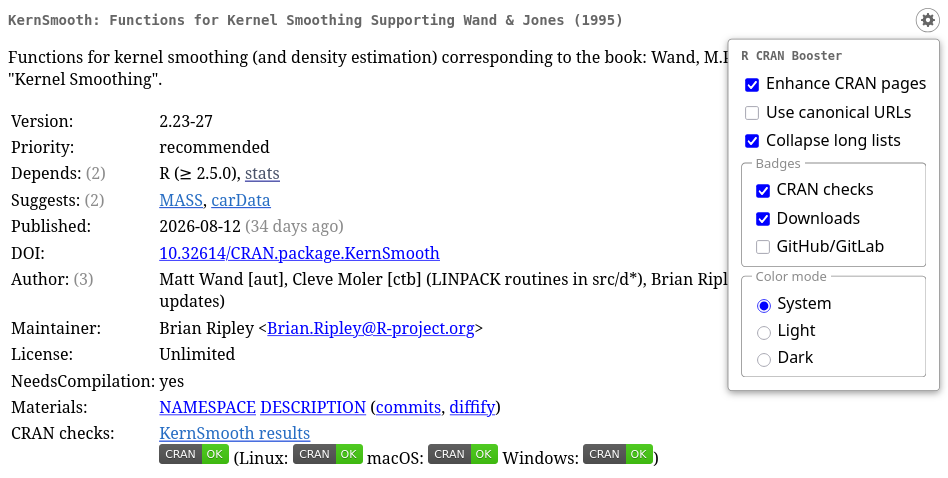

# R CRAN Booster

'R CRAN Booster' is a Firefox browser extension that enhances the browsing experience on [The R Project](https://www.r-project.org)'s [CRAN](https://cran.r-project.org/) package pages.  It runs on Firefox 140 or later on the desktop, and on Firefox 142 or later on Android.  It does _not_ work on Google Chrome.

## Settings

Clicking the settings icon in the upper, right corner opens a popup, where the injections can be turned off, canonical URLs can be turned on, and the color mode can be set to 'System' (default), 'Light', or 'Dark'.  The settings are remembered by the browser, and they apply to all CRAN package pages, also on other CRAN mirrors.

## Installation

Install the extension from Firefox Add-ons:

* <https://addons.mozilla.org/en-US/firefox/addon/r-cran-booster/>

To instead try out the development version, go to `about:debugging#/runtime/this-firefox` in Firefox, click 'Load Temporary Add-on...', and select the 'R_CRAN_Booster/WebExtension/manifest.json' file.  Note that a temporarily installed extension is uninstalled when Firefox terminates.

## License

This extension is licensed under [LGPL (>= 3)](https://www.gnu.org/licenses/lgpl.txt).

## Contributions

This Git repository uses the [Git Flow](http://nvie.com/posts/a-successful-git-branching-model/) branching model (the [`git flow`](https://github.com/petervanderdoes/gitflow-avh) extension is useful for this).  The [`develop`](https://github.com/HenrikBengtsson/R_CRAN_Booster/tree/develop) branch contains the latest contributions and other code that will appear in the next release, and the [`master`](https://github.com/HenrikBengtsson/R_CRAN_Booster) branch contains the latest, stable release.  Contributing to this package is easy.  Just send a [pull request](https://help.github.com/articles/using-pull-requests/).  When you send your PR, make sure `develop` is the destination branch on the [R_CRAN_Booster repository](https://github.com/HenrikBengtsson/R_CRAN_Booster).

## Authors

* Henrik Bengtsson (https://github.com/HenrikBengtsson)
* Chung-hong Chan (https://github.com/chainsawriot)

